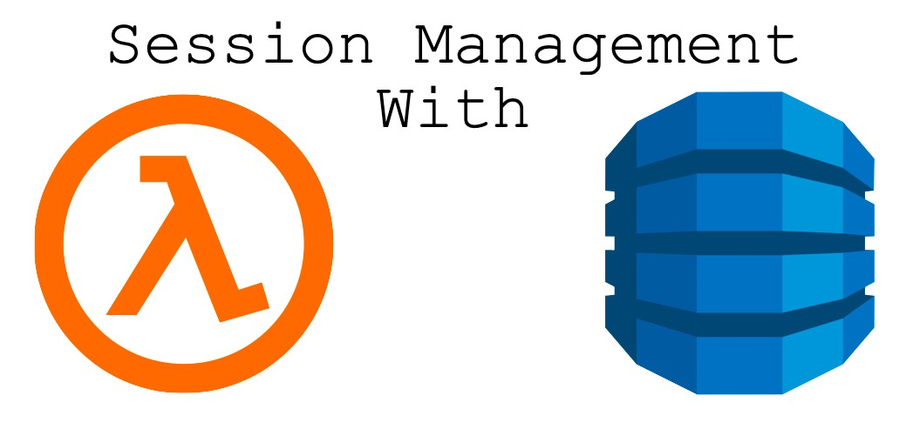

# Session Lambda

<p align="center">

</p>

<p align="center">
    <em>A simple way to manage sessions for AWS Lambdas</em>
</p>

## Install
```
pip install session-lambda
```

## Prerequisites
### DynamoDB Table
- A table in DynamoDB with a primary key named `key` with type string  
- [optional] Enable TTL in your DynamoDB table with attribute named `ttl`

## Usage
Set `SESSION_LAMBDA_DYNAMODB_TABLE_NAME` env var:
```bash
export SESSION_LAMBDA_DYNAMODB_TABLE_NAME=<table-name>
```
Run the following python code:
```python
import time
from session_lambda import session, set_session_data, get_session_data

@session
def lambda_handler(event, context):
    print(get_session_data())
    set_session_data((get_session_data() or 0)+1)
    return {"headers":{}}
```
```python
# first client_a call 
response = lambda_handler({'headers':{}}, {})  
# get session id from response (created by the server)
session_id = response.get('headers').get('session-id')
# use session id in subsequent calls
lambda_handler({'headers':{'session-id':session_id}}, {})
lambda_handler({'headers':{'session-id':session_id}}, {})
lambda_handler({'headers':{'session-id':session_id}}, {})

# first client_b call 
lambda_handler({'headers':{}}, {})
```
You should get the following prints:
```python
None
1
1
1
None
```
This time using the `update=True` mode:
```python
import time
from session_lambda import session, set_session_data, get_session_data

@session(update=True)
def lambda_handler(event, context):
    print(get_session_data())
    set_session_data((get_session_data() or 0)+1)
    return {"headers":{}}
```
```python
# first client_a call 
response = lambda_handler({'headers':{}}, {})  
# get session id from response (created by the server)
session_id = response.get('headers').get('session-id')
# use session id in subsequent calls
lambda_handler({'headers':{'session-id':session_id}}, {})
lambda_handler({'headers':{'session-id':session_id}}, {})
lambda_handler({'headers':{'session-id':session_id}}, {})

# first client_b call 
lambda_handler({'headers':{}}, {})
```
Now you should see:
```python
None
1
2
3
None
```

## Features
```python
@session(id_key_name='session-id', update=False, ttl=0)
def lambda_handler(event, context):
    ...
```
- `id_key_name` is the expected key name in the `event[headers]`. It is default to `session-id`. It is case-sensitive.
- `update` flag control weather `set_sessions_data` updates the data. It is default to `False`.
- `ttl` is seconds interval for the session to live (since the last update time). By default it is disabled. Any value larger then 0 will enable this feature. Make sure to set the TTL key name in your dynamodb to `ttl`.
- `accept_client_generated_session_id` if True let the user initialize the sessions id. By default it is False and the session id is initialized by the server.

## Future Features
- Support Schema validation for session data
